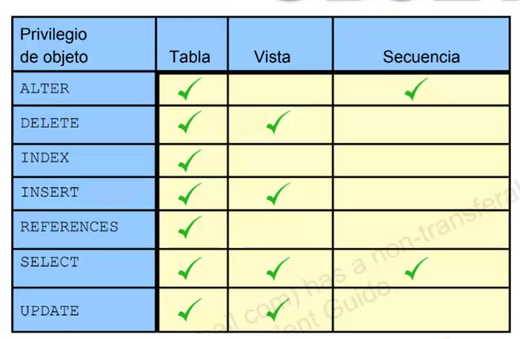
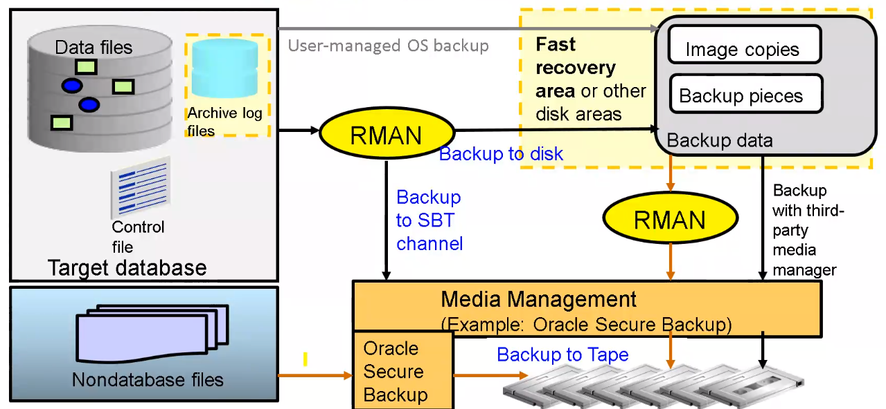
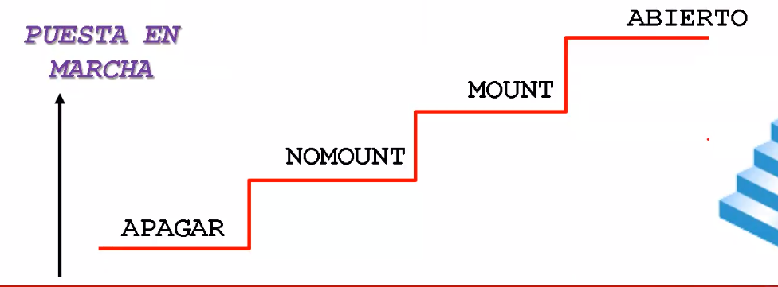
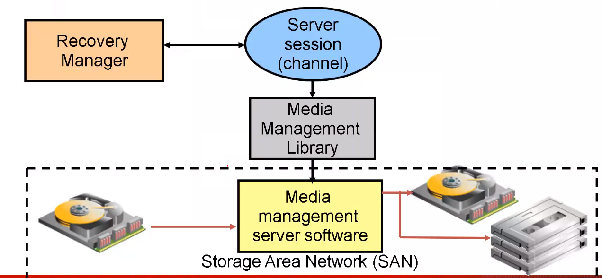
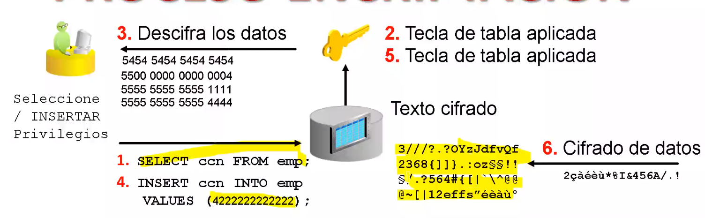
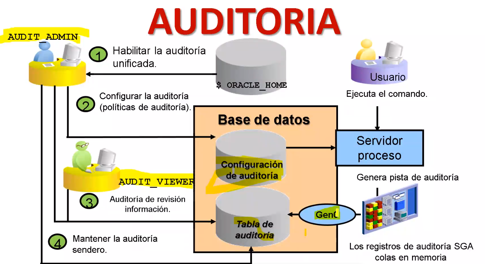

# Módulo de bases de datos

Profesor DBA Carlos Alberto Cañón Romero, ingeniero de sistemas

## 2020-12-04

### Fundamentación

#### Objetivos

* Conocer los orígenes de las bases de datos

* Conocer que es una base de datos

* Reconocer los diferentes motores de bases de datos

* Infraestructura cloud

* Entender los modelos relacionales

* Identificar elementos de un sistema de información

* Describir la implementación del servidor de oracle de RDBMS

#### Agenda

#### Visión general 

##### Historia

El término *BASES DE DATOS*, escuchado por primera vez en un simposio celebrado en California en 1963. En una primera aproximación se puede decir que es un conjunto de información relacionada que se encuentra agrupada o estructurada.

Desde la informática, una base de datos es un sistema formado por un conjunto de datos almacenados en discos que permite el acceso directo a ellos y un conjunto de programas que manipulen ese conjunto de datos

##### Evolución

* SQL/DS de IBM, 1981

* Oracle de RSI, 1981

* DB2 de IBM, 1983

* Informix 1985

* Sybase 1991

* MSSQL Server 1989, 1992

* MS Access 1992

* MySQL 1995

* PostgreSQL 1995

* HyperSQL 2001

* MariaDB 2005

##### Definicion(es)

* *Wikipedia* Es un conjunto de datos pertenecientes a un mismo contexto y almacenados sistemáticamente para su posterior uso

* *Oracle* Una base de datos relacional es una colección de relaciones o tablas de dos dimensiones controladas por el servidor

* *Amazon* Una base de datos relacional es una recopilación de elementos de datos con relaciones predefinidas entre ellos

##### Mercado de bases de datos

Gran variedad de bases de datos, tanto SQL como NoSQL

##### Tipos de servicios Cloud

* Software como servicio SaaS

* Plataforma como servicio PaaS

* Infrastructura como servicio IaaS

##### NoSQL vs SQL

##### Reconocer los diferentes motores de bases de datos

#### Data warehouse vs OLTP

OLTP: On-line transactional processing
OLAP: On-line analytical Processing

###### OLTP

* Fácilita procesamiento en línea

* Respuesta rápida

* Fácil y simple de usar

* Ofrece prioridad transaccional sobre el análisis de datos

###### OLAP

* Analizar datos multidimencionales

* Consistencia en los cálculos

* Restricciones para proteger datos

* Procesamiento de datos acumulados y detallados

* Curva de aprendizaje alta

#### Sistemas de información

Un sistema de información es un conjunto de elementos orientados al tratamiento y administración de datos e información *Wikipedia*

Tres capas:

* Aplicación

* Datos

* Negocio

#### Bases de datos relacionales

Se usa una colección de tablas para representar los datos y sus relaciones

RDBMS = Sistema de gestión de bases de datos relacionales

"Relación" = Tabla

La relación se establece a través de llaves primarias y llaves foraneas (buena práctica)

#### Objetivo de un SGBD

Sistema gestor de bases de datos

Proporcionar una visión abstracta de los datos

Es la herramienta con la cual me conecto a la base de datos

#### Lenguage SQL

Lenguage de consulta estándar para bases de datos relacionales

## 2020-12-09

### Backups y auditoría

#### Gestires de bases de datos

Herramientas con las cuales se administra, opera, interactua con un motor de bases de datos

* La herramienta principal de oracle es Oracle SQL Developer

* Interfaz de línea de comandos SQL*Plus

MySQL, MariaDB: PHPMyAdmin

Postgresql: PGAdmin

#### Seguridad y usuarios

Control de acceso:

*Administrador de bases de datos*: Superusuario

Puede crear usuarios

#### Privilegios del sistema

Una vez creado un usuario, el dba puede otorgar privilegios del sistema específicos para dicho usuario

Un desarrollador de aplicaciones puede pur ejemplo, tener los siguientes privilegios del sistema:

* Create session

* Create table

* Create sequence

* Create view

* Create procedure

#### Privilegios de usuario

* Grant privilege [privilege] to user [user]

El DBA puede otorgar privilegios del sistema a un usuario específico

#### Privilegios de objeto

#### Errores en bases de datos

Los errores se pueden dividir en las siguientes categorías:

* Declaración errada

* Fallo de proces de usuario

* Falla de red

* Error de usuario

* Insuficiencia de la instancia

* Fallos en los medios

|Los problemas típicos | Posibles soluciones |
|----------------------|---------------------|
|Intentos para introducir datos no válidos en una tabla | Trabajar con los usuarios para valdiar y corregir los datos |
|Intentos de realizar opreaciones con privilegios suficientes | Permitir el uso del objeto o sistema adecuados|
|Un usuario realiza una desconexión anormal | La acción de un dba no es generalmente necesaria para resolver fallas en los procesos de usuario, procesos en segundo plano|
| Falla en listener | configurar un listener de copia de seguridad y tiempo de conexión de conmutación por error|
| Tarjeta de interfaz de red falla | Configurar varias tarjetas de red|
| Conexión de red falla | Configurar una conexión de red de copia de seguridad|
| Inadvertidamente usuario elimina o modifica datos | Retrotraer la transacción y las transacciones dependientes o rebobinar la tabla|
|usuario elimina una tabla| Recuperar la tabla de papelera de reciclaje o recuperar tabla de una copia de seguridad|

#### Soluciones de backup

* Una copia de seguridad completa contiene todos los bloques de archivos de datos usados
* Una copia de seguridad inclemental de nivel 0 equivale a una copia de seguriad completa que se ha marcado como nivel 0
* Una copia de segurad incremental acumulativa de nivel 1 contiene solo bloques modificados de la última copia de seguridad de nivel 0
* Una copia de seguriad incremental de nivel diferencial 1 contiene solo bloques modificados desde la última copia de seguridad incremental

Para abrir una base de datos:

* Todos los archivos de control deben estar presentes y sincronizados
* Todos los archivos de datos en línea deben estar presentes y sincronizados
* Al menos un miembro de cada grupo de registro de rehacer debe estar presente

#### Estrategia de backup

Estrategia de copia de seguridad puede incluir:

* Base de datos entera

* Porción de la base de datos

Tipo de copia de seguridad puede indicar inclusión de:

* Todos los bloques de datos dentro de los archivos elegidos

* Solo la información que ha cambiado desde la última copia de seguridad

    * Acumulativos

    * Diferencial

Modo de copia de seguridad

* Desconectado (consistente, en frio)

* En línea (inconsistente, en caliente)

#### Arquitectura proxy

#### Recomendaciones

Backup y recuperación integrados de disco a disco: discos de bajo costo utilizados para un area de recuperación rápida

Copias de seguridad incrementales rápidas: realice copias de seguridad solo de bloques modificados

La copia de seguridad incremental nocturna revierte la copia de seguridad del area de recuperación: No hay necesidad de realizar copias de seguridad completas

#### Compresión

|Relación de compresión|Consideraciones|Requiere la opción de compresión|
| --------------- | --------------------- |----------------|
|Bajo|Rápido. Más adecuado para abordar la opia de seguridad y los recursos de la CPU| si|
|Medio|Rápido. Buen equilibrio entre el uso de la CPU y la relación de compresión|si|
|Alto|Mejor relación de compresión a expensas de un alto consumo de CPU. Más adecuado para abordar la restricción de copia de seguridad:red | si|
|Básica|Justo. Relación de compresión similar a medio a expensas del uso adicional de CPU, relación de compresión entre medio y alto|no|

#### Cifrado de backup

RMAN: Tres métodos de cifrado:

Modo transparente:

Utiliza una clave de cifrado de datos transparente (TDE)

Requiere que primero configure un almacén de claves
Modo de contraseña: Requiere el uso del comando set encryption on identified by password only en los scripts RMAN

Modo dual: Requiere el uso del comando set encryption on identified by password en los scripts RMAN

#### Auditoria

