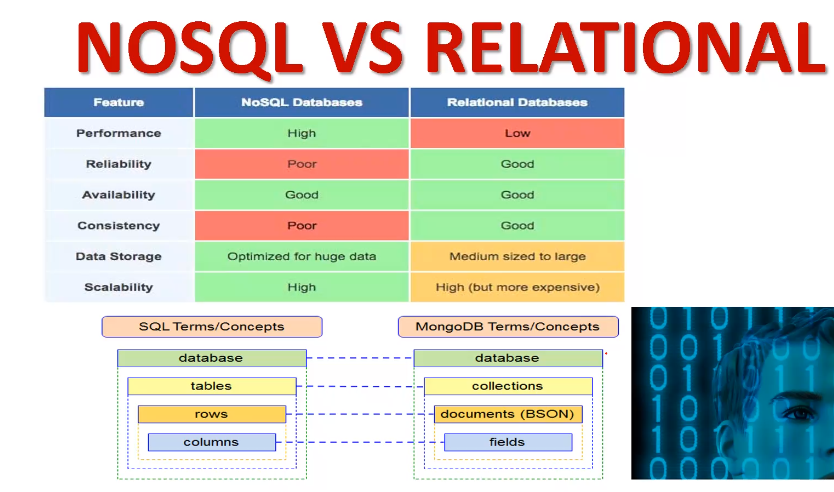
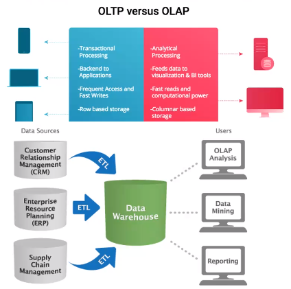
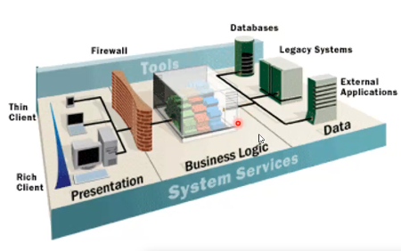

# Módulo de bases de datos

Profesor DBA Carlos Alberto Cañón Romero, ingeniero de sistemas

## 2020-12-04

### Fundamentación

#### Objetivos

* Conocer los orígenes de las bases de datos

* Conocer que es una base de datos

* Reconocer los diferentes motores de bases de datos

* Infraestructura cloud

* Entender los modelos relacionales

* Identificar elementos de un sistema de información

* Describir la implementación del servidor de oracle de RDBMS

#### Agenda

#### Visión general 

##### Historia

El término *BASES DE DATOS*, escuchado por primera vez en un simposio celebrado en California en 1963. En una primera aproximación se puede decir que es un conjunto de información relacionada que se encuentra agrupada o estructurada.

Desde la informática, una base de datos es un sistema formado por un conjunto de datos almacenados en discos que permite el acceso directo a ellos y un conjunto de programas que manipulen ese conjunto de datos

##### Evolución

* SQL/DS de IBM, 1981

* Oracle de RSI, 1981

* DB2 de IBM, 1983

* Informix 1985

* Sybase 1991

* MSSQL Server 1989, 1992

* MS Access 1992

* MySQL 1995

* PostgreSQL 1995

* HyperSQL 2001

* MariaDB 2005

##### Definicion(es)

* *Wikipedia* Es un conjunto de datos pertenecientes a un mismo contexto y almacenados sistemáticamente para su posterior uso

* *Oracle* Una base de datos relacional es una colección de relaciones o tablas de dos dimensiones controladas por el servidor

* *Amazon* Una base de datos relacional es una recopilación de elementos de datos con relaciones predefinidas entre ellos

##### Mercado de bases de datos

Gran variedad de bases de datos, tanto SQL como NoSQL

##### Tipos de servicios Cloud

* Software como servicio SaaS

* Plataforma como servicio PaaS

* Infrastructura como servicio IaaS

##### NoSQL vs SQL

##### Reconocer los diferentes motores de bases de datos

#### Data warehouse vs OLTP

OLTP: On-line transactional processing
OLAP: On-line analytical Processing

###### OLTP

* Fácilita procesamiento en línea

* Respuesta rápida

* Fácil y simple de usar

* Ofrece prioridad transaccional sobre el análisis de datos

###### OLAP

* Analizar datos multidimencionales

* Consistencia en los cálculos

* Restricciones para proteger datos

* Procesamiento de datos acumulados y detallados

* Curva de aprendizaje alta

#### Sistemas de información

Un sistema de información es un conjunto de elementos orientados al tratamiento y administración de datos e información *Wikipedia*

Tres capas:

* Aplicación

* Datos

* Negocio

#### Bases de datos relacionales

Se usa una colección de tablas para representar los datos y sus relaciones

RDBMS = Sistema de gestión de bases de datos relacionales

"Relación" = Tabla

La relación se establece a través de llaves primarias y llaves foraneas (buena práctica)

#### Objetivo de un SGBD

Sistema gestor de bases de datos

Proporcionar una visión abstracta de los datos

Es la herramienta con la cual me conecto a la base de datos

#### Lenguage SQL

Lenguage de consulta estándar para bases de datos relacionales
