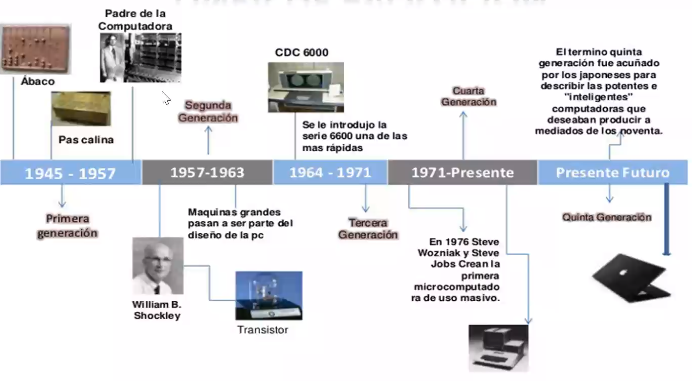

# 2020-12-16

## Evolución de la computación

## Globalización

El coronaviros globalizó el mercado laboral

## La información como activo

La información es un activo independientemente del medio en el que se almacene

* La banda ancha ya es un derecho universal para los Finlandeses, derecho a una conexión a internet de, como mínimo 1Mbps

## Evolucion del cibercrimen

### 1986-1995

* Motivación: daño
* Primeros virus
* Exploración

### 1995-2003

* Motivación: daño
* Era del internet
* Gusanos

### 2004+

* Motivación: Dinero
* Spyware spam
* SQL ataques

### 2006+

* Motivación: dinero - político
* Ataques dirigidos
* Ingeniería social
