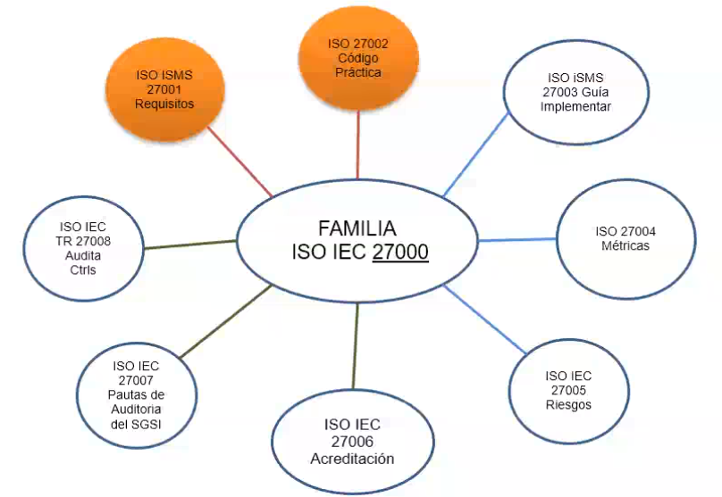
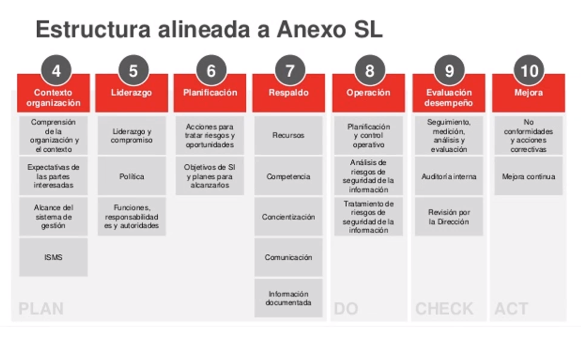
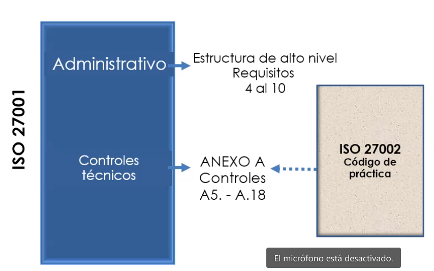
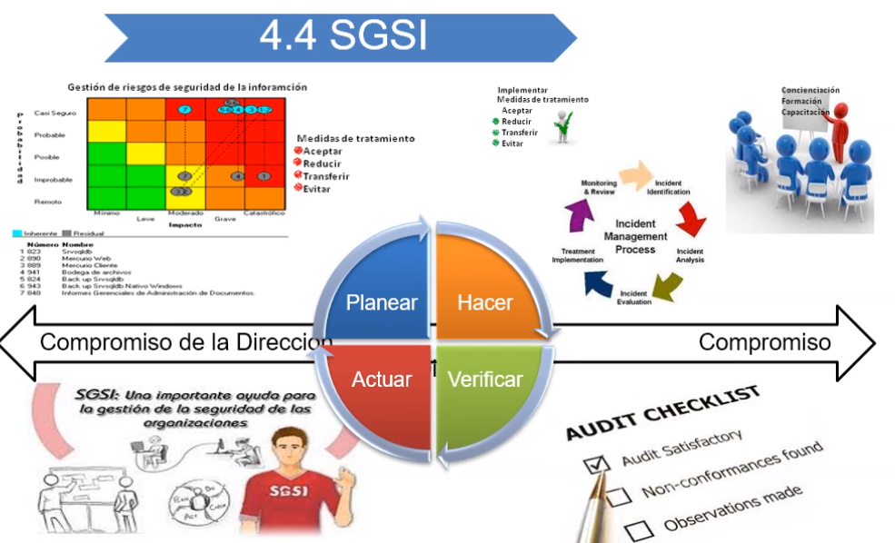
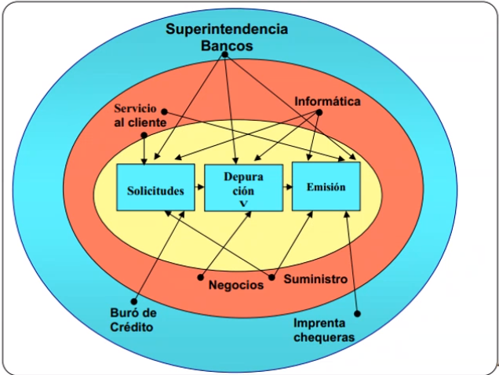
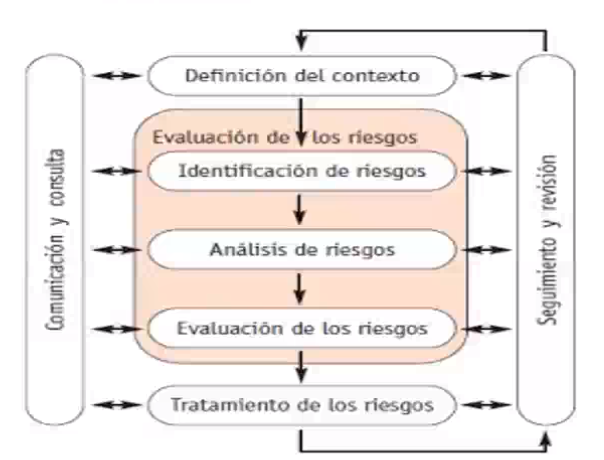
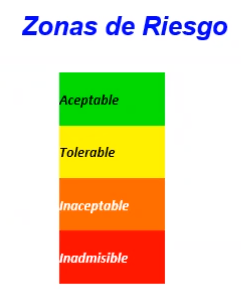
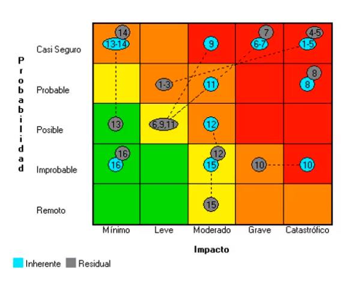

# 2020-12-10

## Que es la ISO27000

Es una familia de estándares internacionales para sistemas de gestión de la seguridad de la información

|Requisitos para la especificación de sistemas de gestión de la seguridad de la información|Proceso del análisis y gestión del riesgo|Metricas y medidas de protección|Guias de implantación|Vocabulario claramente definido para evitar distintas interpretaciones de conceptos técnicos y de gestión y mejora contínua|
|------|------|------|-----|-----|

### Métricas y medidas de protección

Lo que no se mide no se puede mejorar

## Actualización de las normas ISO 27000

Las normas internacionales se revisan cada cierto tiempo con el fin de asegurar la presente adecuación con las buenas prácticas empresariales y con las tendencias tecnológicas en los países donde son aplicables

Cuando alguien se certifica en una versión específica no puede auditar ni liderar implementaciones de versiones posteriores. Hay capacitaciones especiales de actualización/recertificación

## ISO 27001:2013

### Objeto

Especifica los requistos para establecer, implementar, mantener y mejorar continuamente un SGSI

### Campos de aplicación

Los requisitos son genéricos y están previstos para ser aplicables a todas las organizaciones independientemente de su tipo, tamaño o naturaleza.

### Familia de normas ISO 27000

ISO 27001 está compuesta por 14 dominios, 35 objetivos de control, 114 controles

### Sistema de gestión de seguridad de la información (SGSI)

Proceso estratégico creado para agregar valor a la organización, concebido con el objetivo de gestionar los riesgos de la confidencialidad, integridad y disponibilidad de la información

* Escrita, en imágenes, oral, impresa en papel, almacenada electrónicamente, proyectada, enviada por correo, fax o email, transmitida en conversaciones, etc

### Seguridad de la información != Seguridad informática

Seguridad de la información: Proteger activos de información

https://www.youtube.com/watch?v=zV2sfyvfqik

|Seguridad de la información|Seguridad informática|
|----|----|

### Anexo SL

Es una directriz de la ISO para la redacción de normas de sistemas de gestión basadas en tres pilares:

#### Títulos idénticos para los capítulos

* Todas las normas tendrán los mismos capítulos y secciones básicas
* Para cada norma particular pueden adicionarse subcapítulos y subcláusulas

#### Textos y términos comunes idénticos

* Todos los elementos comunes a todas las normas se describirán usando los mismos textos (texto estándar - anexo SL)
* En todas las normas se utilizarán términos iguales con significados iguales

#### Definiciones principales idénticas

* En todas las normas se utilziará el mismo vocabulario básico
* Para cada norma podrán establecerse definiciones adicionales pero únicamente para términos técnicos de la especialidad

### Estrucutra general de la norma

**La norma define seguridad como la preservación de:**

* Confidencialidad: Propiedad que determina que la información esté disponible y sea revelada a quien esté autorizado
* Integridad
* Disponibilidad

### Contexto de la organización

### Implantación del sistema

https://www.youtube.com/watch?v=i_3z68QGaJs

Se recomienda un comité de tres personas para identificar los activos y sus riesgos asociados

### Definición del alcance del SGSI

#### Metodología de las elipses

Ejemplo

### 5. Liderazco

#### 5.1 Liderazgo y compromiso

* Asegurando que se establece la política los objetivos del SGSI
* Asegurando la integración de los requisitos del SGSI con los procesos del negocio
* Asegurando la disponibilidad de los recursos necesarios
* Comunicando la importancia de una gestión eficaz y de conformidad con los requisitos del SGSI

#### 5.2 Política

* Adecuada para el propósito de la empresa
* Incluya objetivos de seguridad de la información
* Incluya un compromiso de cumplir los requisitos aplicables relacionados con la seguridad
* Estar documentada y comunicada

#### 5.3 Roles, responsabilidades y autoridades en la organización

* La alta dirección debe asegurarse de que se asignan y comunican las responsabilidades y autoridades

### 6. Planificación

6.1 Acciones para tratar riesgos y oportunidades

6.2 Objetivos de la seguridad de la información y planes para lograrlos

### Conceptos básicos

**Definición de riesgo según ISO31000:2009:** Efecto de la incertidumbre en los objetivos

**Otra definición de riesgo:** Posibilidad de ocurrencia de cualquier evento interno o externo que puede afectar una empresa, ocacionándole pérdidas que disminuyen la capacidad para lograr sus objetivos y generar valor para sus accionestas, dueños, grupos de interés y beneficiarios
_Administración de riesgos. Un enfoque empresarial_
_Rubi Consuelo Mejia_

**Apetito de riesgo:** Que tanto estoy dispuesto a perder sin arriesgar mi empresa

|Subcategoria|Riesgo|Descripción|
|----|---|---|
|Confidencialidad|Acceso no autorizado|Entrada sin la autorización del responsable del activo de información asignado por la entidad par su uso|
|Integridad|Daños en la integridad de la información|Acto de borrar, suprimir o modificar sin autorización datos de un sistema de información o de cualquier otro activo con la intención de obstaculizar el funcionamiento norma ldel mismo o sin la intención de hacerlo|
|Disponibilidad|Interrupción de la operación|Situación prevista o imprevista que causa una desviación negativa no planificada con respecto a la entrega esperada de productos o servicios de acuerdo con los objetivos de la empresa|

**Aversión al riesgo** Actitud de rechazo que experimenta un inversor ante el riesgo financiero, en concreto ante la posibilidad de sufrir pérdida en el valor de sus activos. El grado de aversión al riesgo determina el perfil del inversor (conservador, medio, arriesgado) y debe ser el punto de partida para elegir un punto de inversión

**Aceptabilidad del riesgo**: Expresión gráfica del apetito por el riesgo de la empresa, representado en los niveles de riesgo o severidad

**Amenaza** Situación que puede generar consecuencias negativas o la simple posibilidad que el efecto negativo se materialice. Es el peligro en si mismo

Una amenaza es la posibilidad de ocurrencia de cualquier tipo de evento o acción que puede producir un daño material o inmaterial sobre los elementos del sistema

**Vulnerabilidad** Debilidad o falencia en las medidas de seguridad de un activo de información que pueda ser aprovechada por una amenaza

**Activo de información** Todo activo de tipo magnético o físico que represente valor para la organización

_¿cómo determinar si algo es un activo de información?_

* ¿Se conoce, se entiende qué es y se sabe para qué es útil el activo de información?
* ¿Tiene valor para la organización?
* ¿Tendrá algún costo o valor volver a conseguir la información en caso de pérdida?
* ¿Existirá alguna repercusión de tipo legal, reputacional o financiera en caso de que en caso de que no se pudiera producir la información solicitada por alguna de las partes interesadas?
* ¿Tendrá algún efecto en la eficiencia de las opreaciones en caso de que no se pueda tener acceso fácilmente a la información?
* ¿Existirán otras consecuencias en caso de no tener esa información?
* ¿Existe algún riesgo asociado con la información?
* ¿Existe algún riesgo de pérdida de la información?
* ¿Existe el riesgo de que la información sea exacta?

#### Matriz de activos de información

|id|categoria activo|nombre activo|descripcion|propietario|ubicación|medio de transmisión|consumidores|valor del activo|medio de almacenamiento|
|-----|-----|-----|-----|----|----|----|----|---|---|
|1|software|bussines object|suite de herramientas que permitan visualizar la información que se almacena en la bodega de datos|responsable del proceso de bi|svrprdbo|Electrónico|Director,Gerentes,Jefes de area, Coordinadores y analistas de información||Electrónico|
|2|Hardware|Svrpdbo|Servidor donde se encuentra aljoado el aplicatiov business object. Hace parte de una cuchilla ubicada en el blade center|Jefe del departamento de informática|Cuchilla BI-blade center|NA|Bussines Object||Físico|

### 7.2 Competencia

Se debe:

* Determinar la competencia de las personas que realizan un trabajo que afecte el desempeño de la seguridad de la información
* Asegurar que las personas sean competentes, basándose en: educación, formación o experiencia adecuadas.
* Tomar acciones para adquirir la competencia necesaria y evaluar su eficacia
* Conservar la información documentada como evidencia

### 7.3 Toma de conciencia

Las personas deben tomar conciencia de la política, su contribución a la eficacia, incluyendo los beneficios a la mejora del desempeño, las implicaciones de la no conformidad con los requisitos del SGSI

### 7.5 Información documentada

7.5.1 Generalidades

Debe incluir información documentada requerida por la norma, que la organización ha determinado que es necesaria

7.5.2 Creación y actualización

Se debe asegurar que: La identificación y descripción.
El formato y sus medios de soporte
La revisión y aprobación con respecto a la idoneidad y adecuación

7.5.3 Control de la información documentada

Para controlar se debe: Asegurar que esté disponible y adecuada para su uso, cuando y donde se requiera.
Esté protegida adecuadamente.
Almacenamiento y preservación, incluso legilibilidad.
Control de cambios.
Retención y disposición

La siguiente lista detalla la cantidad mínima de documentos y registros requeridos por la revisión 2013 de la norma ISO/IEC 27001:

|Documentos|Capítulo de ISO 27001:2013|
|---|---|
|Alcance del SGSI|4.3|
|Políticas y objetivos de seguridad de la información|5.2, 6.2|
|Metodología de evaluación y tratamiento de riesgos|6.1.2|
|Declaración de aplicabilidad|6.1.3 d)|
|Plan de tratamiento del riesgo|...|
|...|...|

|Registros|Capítulo|
|----|----|
|Registros de capacitación, habilidades, experiencia y calificaciones|7.2|
|Resultados de supervisión y medición|9.1|
|Programa de auditoría interna|9.2|
|Resultados de las auditorías internas|9.2|
|Resultados de la revisión por parte de la dirección|9.3|
|Resultados de acciones correctivas|10.1|
|Registros sobre actividades de los usuarios, excepciones y eventos de seguridad|A 12.4.1, A 12.4.3|

