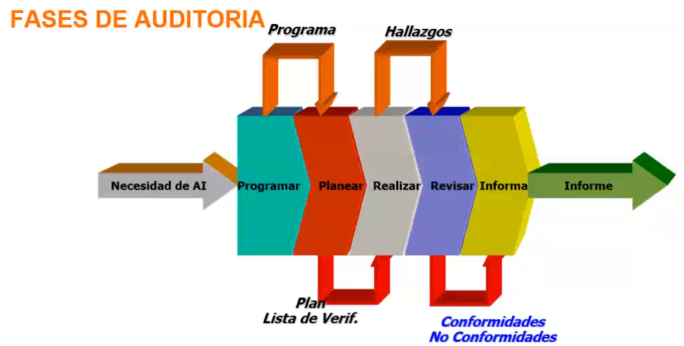
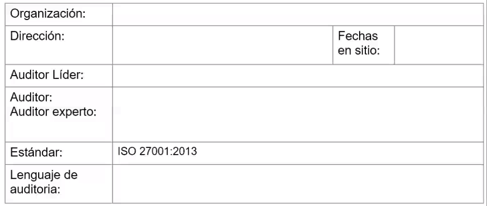
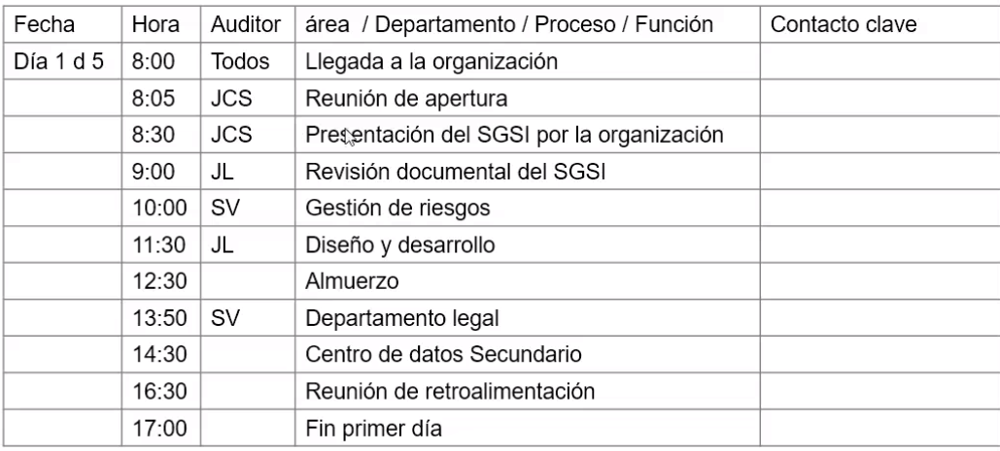
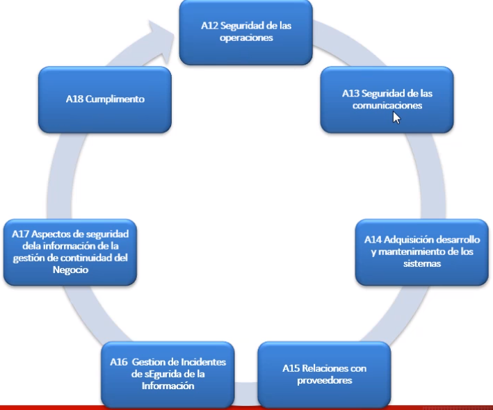
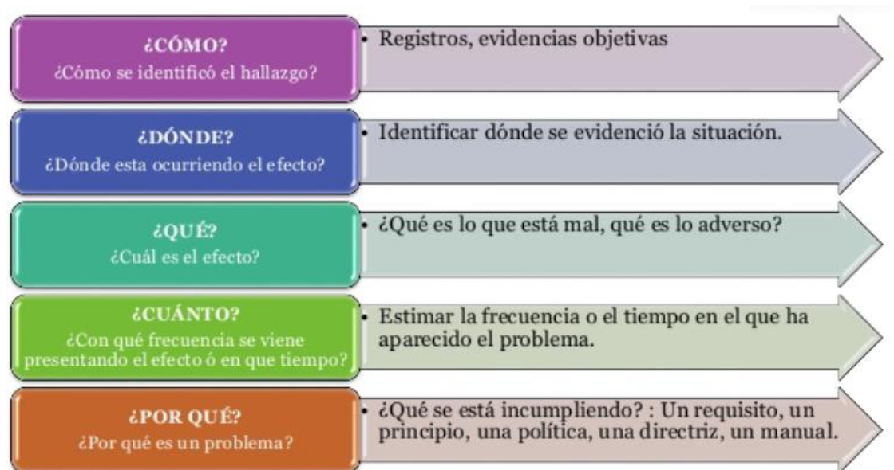

# 2020-12-10

## Que es la ISO27000

Es una familia de estándares internacionales para sistemas de gestión de la seguridad de la información

|Requisitos para la especificación de sistemas de gestión de la seguridad de la información|Proceso del análisis y gestión del riesgo|Metricas y medidas de protección|Guias de implantación|Vocabulario claramente definido para evitar distintas interpretaciones de conceptos técnicos y de gestión y mejora contínua|
|------|------|------|-----|-----|

### Métricas y medidas de protección

Lo que no se mide no se puede mejorar

## Actualización de las normas ISO 27000

Las normas internacionales se revisan cada cierto tiempo con el fin de asegurar la presente adecuación con las buenas prácticas empresariales y con las tendencias tecnológicas en los países donde son aplicables

Cuando alguien se certifica en una versión específica no puede auditar ni liderar implementaciones de versiones posteriores. Hay capacitaciones especiales de actualización/recertificación

## ISO 27001:2013

### Objeto

Especifica los requistos para establecer, implementar, mantener y mejorar continuamente un SGSI

### Campos de aplicación

Los requisitos son genéricos y están previstos para ser aplicables a todas las organizaciones independientemente de su tipo, tamaño o naturaleza.

### Familia de normas ISO 27000

ISO 27001 está compuesta por 14 dominios, 35 objetivos de control, 114 controles

### Sistema de gestión de seguridad de la información (SGSI)

Proceso estratégico creado para agregar valor a la organización, concebido con el objetivo de gestionar los riesgos de la confidencialidad, integridad y disponibilidad de la información

* Escrita, en imágenes, oral, impresa en papel, almacenada electrónicamente, proyectada, enviada por correo, fax o email, transmitida en conversaciones, etc

### Seguridad de la información != Seguridad informática

Seguridad de la información: Proteger activos de información

https://www.youtube.com/watch?v=zV2sfyvfqik

|Seguridad de la información|Seguridad informática|
|----|----|

### Anexo SL

Es una directriz de la ISO para la redacción de normas de sistemas de gestión basadas en tres pilares:

#### Títulos idénticos para los capítulos

* Todas las normas tendrán los mismos capítulos y secciones básicas
* Para cada norma particular pueden adicionarse subcapítulos y subcláusulas

#### Textos y términos comunes idénticos

* Todos los elementos comunes a todas las normas se describirán usando los mismos textos (texto estándar - anexo SL)
* En todas las normas se utilizarán términos iguales con significados iguales

#### Definiciones principales idénticas

* En todas las normas se utilziará el mismo vocabulario básico
* Para cada norma podrán establecerse definiciones adicionales pero únicamente para términos técnicos de la especialidad

### Estrucutra general de la norma

**La norma define seguridad como la preservación de:**

* Confidencialidad: Propiedad que determina que la información esté disponible y sea revelada a quien esté autorizado
* Integridad
* Disponibilidad

### Contexto de la organización

### Implantación del sistema

https://www.youtube.com/watch?v=i_3z68QGaJs

Se recomienda un comité de tres personas para identificar los activos y sus riesgos asociados

### Definición del alcance del SGSI

#### Metodología de las elipses

Ejemplo

### 5. Liderazco

#### 5.1 Liderazgo y compromiso

* Asegurando que se establece la política los objetivos del SGSI
* Asegurando la integración de los requisitos del SGSI con los procesos del negocio
* Asegurando la disponibilidad de los recursos necesarios
* Comunicando la importancia de una gestión eficaz y de conformidad con los requisitos del SGSI

#### 5.2 Política

* Adecuada para el propósito de la empresa
* Incluya objetivos de seguridad de la información
* Incluya un compromiso de cumplir los requisitos aplicables relacionados con la seguridad
* Estar documentada y comunicada

#### 5.3 Roles, responsabilidades y autoridades en la organización

* La alta dirección debe asegurarse de que se asignan y comunican las responsabilidades y autoridades

### 6. Planificación

6.1 Acciones para tratar riesgos y oportunidades

6.2 Objetivos de la seguridad de la información y planes para lograrlos

### Conceptos básicos

**Definición de riesgo según ISO31000:2009:** Efecto de la incertidumbre en los objetivos

**Otra definición de riesgo:** Posibilidad de ocurrencia de cualquier evento interno o externo que puede afectar una empresa, ocacionándole pérdidas que disminuyen la capacidad para lograr sus objetivos y generar valor para sus accionestas, dueños, grupos de interés y beneficiarios
_Administración de riesgos. Un enfoque empresarial_
_Rubi Consuelo Mejia_

**Apetito de riesgo:** Que tanto estoy dispuesto a perder sin arriesgar mi empresa

|Subcategoria|Riesgo|Descripción|
|----|---|---|
|Confidencialidad|Acceso no autorizado|Entrada sin la autorización del responsable del activo de información asignado por la entidad par su uso|
|Integridad|Daños en la integridad de la información|Acto de borrar, suprimir o modificar sin autorización datos de un sistema de información o de cualquier otro activo con la intención de obstaculizar el funcionamiento norma ldel mismo o sin la intención de hacerlo|
|Disponibilidad|Interrupción de la operación|Situación prevista o imprevista que causa una desviación negativa no planificada con respecto a la entrega esperada de productos o servicios de acuerdo con los objetivos de la empresa|

**Aversión al riesgo** Actitud de rechazo que experimenta un inversor ante el riesgo financiero, en concreto ante la posibilidad de sufrir pérdida en el valor de sus activos. El grado de aversión al riesgo determina el perfil del inversor (conservador, medio, arriesgado) y debe ser el punto de partida para elegir un punto de inversión

**Aceptabilidad del riesgo**: Expresión gráfica del apetito por el riesgo de la empresa, representado en los niveles de riesgo o severidad

**Amenaza** Situación que puede generar consecuencias negativas o la simple posibilidad que el efecto negativo se materialice. Es el peligro en si mismo

Una amenaza es la posibilidad de ocurrencia de cualquier tipo de evento o acción que puede producir un daño material o inmaterial sobre los elementos del sistema

**Vulnerabilidad** Debilidad o falencia en las medidas de seguridad de un activo de información que pueda ser aprovechada por una amenaza

**Activo de información** Todo activo de tipo magnético o físico que represente valor para la organización

_¿cómo determinar si algo es un activo de información?_

* ¿Se conoce, se entiende qué es y se sabe para qué es útil el activo de información?
* ¿Tiene valor para la organización?
* ¿Tendrá algún costo o valor volver a conseguir la información en caso de pérdida?
* ¿Existirá alguna repercusión de tipo legal, reputacional o financiera en caso de que en caso de que no se pudiera producir la información solicitada por alguna de las partes interesadas?
* ¿Tendrá algún efecto en la eficiencia de las opreaciones en caso de que no se pueda tener acceso fácilmente a la información?
* ¿Existirán otras consecuencias en caso de no tener esa información?
* ¿Existe algún riesgo asociado con la información?
* ¿Existe algún riesgo de pérdida de la información?
* ¿Existe el riesgo de que la información sea exacta?

#### Matriz de activos de información

|id|categoria activo|nombre activo|descripcion|propietario|ubicación|medio de transmisión|consumidores|valor del activo|medio de almacenamiento|
|-----|-----|-----|-----|----|----|----|----|---|---|
|1|software|bussines object|suite de herramientas que permitan visualizar la información que se almacena en la bodega de datos|responsable del proceso de bi|svrprdbo|Electrónico|Director,Gerentes,Jefes de area, Coordinadores y analistas de información||Electrónico|
|2|Hardware|Svrpdbo|Servidor donde se encuentra aljoado el aplicatiov business object. Hace parte de una cuchilla ubicada en el blade center|Jefe del departamento de informática|Cuchilla BI-blade center|NA|Bussines Object||Físico|

### 7.2 Competencia

Se debe:

* Determinar la competencia de las personas que realizan un trabajo que afecte el desempeño de la seguridad de la información
* Asegurar que las personas sean competentes, basándose en: educación, formación o experiencia adecuadas.
* Tomar acciones para adquirir la competencia necesaria y evaluar su eficacia
* Conservar la información documentada como evidencia

### 7.3 Toma de conciencia

Las personas deben tomar conciencia de la política, su contribución a la eficacia, incluyendo los beneficios a la mejora del desempeño, las implicaciones de la no conformidad con los requisitos del SGSI

### 7.5 Información documentada

7.5.1 Generalidades

Debe incluir información documentada requerida por la norma, que la organización ha determinado que es necesaria

7.5.2 Creación y actualización

Se debe asegurar que: La identificación y descripción.
El formato y sus medios de soporte
La revisión y aprobación con respecto a la idoneidad y adecuación

7.5.3 Control de la información documentada

Para controlar se debe: Asegurar que esté disponible y adecuada para su uso, cuando y donde se requiera.
Esté protegida adecuadamente.
Almacenamiento y preservación, incluso legilibilidad.
Control de cambios.
Retención y disposición

La siguiente lista detalla la cantidad mínima de documentos y registros requeridos por la revisión 2013 de la norma ISO/IEC 27001:

|Documentos|Capítulo de ISO 27001:2013|
|---|---|
|Alcance del SGSI|4.3|
|Políticas y objetivos de seguridad de la información|5.2, 6.2|
|Metodología de evaluación y tratamiento de riesgos|6.1.2|
|Declaración de aplicabilidad|6.1.3 d)|
|Plan de tratamiento del riesgo|...|
|...|...|

|Registros|Capítulo|
|----|----|
|Registros de capacitación, habilidades, experiencia y calificaciones|7.2|
|Resultados de supervisión y medición|9.1|
|Programa de auditoría interna|9.2|
|Resultados de las auditorías internas|9.2|
|Resultados de la revisión por parte de la dirección|9.3|
|Resultados de acciones correctivas|10.1|
|Registros sobre actividades de los usuarios, excepciones y eventos de seguridad|A 12.4.1, A 12.4.3|

# 2020-12-14

### 8 operación

#### 8.1 Planificación y control operacional

Se debe planificar, implementar y controlar los procesos necesarios para cumplir los requisitos y para implementar las accioens determinadas en la  gestión de riesgos

#### 8.2 Evaluación de riesgos de la seguridad de la información

Se debe llevar a cabo evaluaciones de riesgos a intervalos planificados o cuando se propongan u ocurran cambios significativos. Ver 6.1.2.a

#### 8.3 Tratamiento de riesgos de la seguridad de la información

Se debe implementar un plan de tratamiento de riesgos, se debe conservar información documentada sobre los planes de tratamiento de riesgos

### 9 Evaluación de desempeño

#### 9.1 Seguimiento, medición, análisis y evaluación

Se debe determinar

* A que se require hacer seguimiento y medir
* Los métodos de seguimiento, medición, análisis y evaluación
* Quién debe llevar a cabo el seguimiento y la medición
* Cuando se deben analizar y evaluar los resultados
* Quien debe analizar y evaluar los resultados

##### Matriz de comunicación interna y externa

|A qué realizar seguimiento|Método a utilizar|Cuando realizar el seguimiento y la medición|Responsabñe|Cuando analizar y evaluar los resultados|Responsable de evaluar los resultados|
|--------|-----------|-----------|-----------|-----------|---------|
|política de control de acceso|Verificación del indicador de la política de control de acceso. Verificar los incidentes relacionados con accesos no autorizados|Según la periodicidad definida|Responsable de la seguridad de la información en la organización. Auditoría|Según la periodicidad definida|Responsable de la seguridad de la información en la organización. Auditoría|

#### 9.2 Auditoría interna

Se debe llevar a cabo auditorías internas a intervalos planificados para proporcionar información acerca de si el SGSI es conforme con:

* Los propios requisitos de la organización para el SGSI
* Los requisitos de la norma

Se debe:

* Planificar, implemntar y mantener uno o varios programas de auditoría que tenga: frecuencia, métodos, responsabilidades, informes, etc.
* Definir criterios y alcance
* Seleccionar los auditores
* Asegura de que los resultados se informen a la dirección
* Conservar información documentada de la implementación del programa de auditoría y de los resultados de ésta

#### Tipos de auditoría

##### De primera parte

Auditorías internas que pueden ser realizadas por personal de la organización o por una entidad externa

##### De segunda parte

Una auditoría realizada por una organización a sus proveedores

##### De tercera parte

Una auditoría realizada por una organización independiente comercial y contractualmente a la organización, sus proveedores y clientes. Es una auditoría realizada por un organismo que esté certificada para otorgar la certificacion al SG al ente auditado

**Nota:** Cuando se adjuntan dos o más sistemas de gestión de diferentes disciplinas (ej, Calidad, ambiental, seguridad, etc) esto se denomina auditoría combinada

#### Principios de auditoría

Conceptos ISO 19011

**Integridad** Considerado el fundamento del profesionalísmo del auditor

**Presentación ecuanime** La oblicación de informar con veracidad y exactitud

**Debido cuidado profesional** La aplicación diligencia y juicio al auditar. Los auditores deben proceder con el debido cuidado, de acuerdo con la importancia de la tarea que desempeñan y la confianza depositada en ellos por el cliente de la auditoría por otras partes interesadas

**Confidencialidad** Seguridad de la información. El auditor debe mantener discreción en el uso y protección sobre la información obtenida en el curso de la auditoría

**Independencia** La base de la imparcialidad de la auditoría y objetividad en las concluciones de la auditoría. El auditor debe ser independiente y debe actuar en todos los casos libre de cualquier conflicto de interés

**Enfoque basado en la evidencia** El método racional para alcanzar las concluciones de la auditoría fiables y reproducibles en un proceso de auditoría sistemático. La evidencia de la autoridad es verificable. Está basada en muestras de la información disponible, ya que una auditoría se lleva a cabo durante un periodo de tiempo delimitado y con recursos finitos

### Conceptos de la ISO 19011

**Auditoría**

Proceso sistemático, independiente y documentado para obtener evidencias de la auditoría y evaluarlas de manera objetiva.

**Alcance de la auditoría (3.14)**

Extensión y límites de una auditoría

El alcance de la auditoría incluye generalmente una descripción de las ubicaciones físicas, las unidades organizacionales, actividades y procesos, así como el periodo de tiempo cubierto

**Programa de auditoría (3.13)**

Conjunto de una o más auditorías planificadas para un periodo de tiempo determinado y dirigidas hacia un propósito específico

Un programa de auditoría incluye todas las actividades necesarias para planificar, organizar y llevar a cabo las auditorías

**Plan de auditoría (3.15)**

Descripción de las actividades y de los detalles acordados de una auditoría

**Criterios de auditoría (3.2)**

Conjunto de políticas, procedimientos o requisitos utilizados como referencia para comparar contra la evidencia obtenida

**Auditor (3.8)**

Persona con la competencia para conducir una auditoría

**Evidencia de auditoría (3.3)**
Registros, declaraciones o cualquier otra información relevante que esté relacionada con los criterios de auditoría y que sea verificable

**Competencia (3.17)**

Habilidad para aplicar los conocimientos y habilidades con el fin de obtener los resultados deseados

**Experto técnico (3.10)**
Persona que proevee conocimiento específico o experiencia al euqipo auditor. No actua como auditor.

**Hallazgos de la auditoría (3.4)**

Resultados de la evaluación de la evidencia recopilada durante la auditoría, frente a los criterios de auditoría

**Conclusión de auditoría (3.5)**

Resultado de una auditoría que proporciona el equipo auditor tras considerar los objetivos de la auditoría y todos los hallazgos resultado de la auditoría

**Observador (3.11)**

Persona que acompaña el equipo de auditoría pero no actua como auditor

**Auditado (3.7)**

Organización a ser auditada

**Guia (3.12)**

Persona designada por el auditado para ayudar al equipo de auditoría

#### 9.2 Auditoría interna

#### 9.2 Programa de auditoría

##### 1.1 Definir el responsable del programa de auditoría

* Establecer objetivos y amplitud del programa de auditoría
* Establecer responsabilidades y procedimientos y asegurarse de la asignación de recursos
* Asegurarse de la implementación del programa de auditoría
* Asegurarse de mantener los registros
* Realizar seguimiento, revisar y mejorar el programa de auditoria

##### 1.2 Establecer el programa de auditoría (alcance)

1.2.1 Objetivo
a) Cumplir con los requisitosdel SGSI
b) Verificar la conformidad con los requisitos contractuales
c) Obtener y mantener la confianza en la capacidad de un proveedor
d) Contribuir con la mejora del SGSI
1.2.2 Extensión
a) Alcance y duración de cada auditoria
b) cualquier aspecto idiomático, cultural o social
c) el número, la importancia y la ubicación de las actividades
d) las normas, requisitos legales, reglamentarios y contractuales
1.2.3 Recursos
1.2.4 Procedimiento

##### Implementación del programa de auditoría (H)
2.1 Ejecución del calendario de auditorías
2.2 Selección del equipo auditor
* Competencia del auditor y evaluación de desempeño
* Selección del equipo auditor (acuerdo de confidencialidad)
2.3 Conducción de las actividades de auditoría
2.4 Conservación de los registros
* Plan de auditoría
* Informes de auditoría
* Informe de no conformidades
* Informe de acciones correctivas y preventivas
* Informes de seguimiento de la auditoría

##### Seguimiento y revisión del programa de auditoría (V)

* Resultados y tendencias

* Prácticas alternativas de auditoria o nuevas

* Conformidad procedimientos

* Expectativas de las partes interesadas

* Registros de resultados

* Desempeño equipo auditor

##### Mejora del programa de auditoría (A)

3.1  Identificación de la necesidad de acciones correctivas y preventivas.
3.2  Identificación de oportunidades de mejora
4.1 Capacitación de auditores (Mantenimiento y mejora de la competencia)
4.2 Aumento en la eficiencia del programa
4.3 Adecuación a las necesidades cambiantes de las partes interesadas
4.4 Coherencia en la fiabilidad del equipo auditor

##### Plan de auditoría

* Objetivos y alcance
* Documento o estándar de referencia
* Lugares y contactos claves
* Areas o dependencias que serán auditadas
* Determinación de las cláusulas claves para preparar la lista de verificación
* Personal de contacto
* Definición del rol de cada miembro del grupo de auditores.
* Fechas de la revisión.
* Hora y duración esperada para cada actividad principal.
* Programación de reuniones.
* Claridad en los requisitos de confidencialidad.
* Distribución del informe y  fecha esperada de la publicación.
* Elaboración y preparación de los documentos de trabajo.

### Anexo A

## Segunda parte: Complemento de auditoría

### Tipos de hallazgos

* No conformidad
* Observacion

### Tips para redactar el hallazgo

* No conformidad (lo que incumple)
* Numeral, política, condición o referenciación que se incumple
* Evidencia objetiva

### Descripción del hallazgo

### Recomendaciones

Evitar palabras como:_nadie_, _ninguno_, _todos_, _siempre_, _nunca_, _algunos_, _bastantes_, _demasiados_, _pocos_, _varios_ o _en ocaciones_

No incluya un hallazgo si no encuentra evidencia suficiente

### Ejercicios:

##### Ejercicio 1

Durante la realización de auditoria en la organización "SSCGraphics", el Gerente de la empresa explica que cuando usted vaya al proceso de producción, no va encontrar al Director de Producción ni a dos Operadores considerados fundamentales para el mismo, debido a que fueron retirados por problemas de bajo desempeño.
Usted pregunta ¿cuanto hace que fueron retirados? Le responden que desde hace tres meses, pues el personal es contratado a término fijo y no han sido reemplazados porque el jefe financiero aún no ha designado los recursos necesarios.
Usted escribe su comentario en su lista de chequeo.Así mismo usted pregunta ¿Cómo ha definido las competencias para el Director de producción, Operador del servidor de correo y Operador del servidor de aplicaciones?, el Gerente le entrega unos documentos y explica que ha sido un trabajo muy bueno, realizado para definir las características de cada cargo.
Después de revisarlos, sólo observa definidas las responsabilidades.
Usted verifica los registros de terminación de la contratación laboral y no se encuentran.

**Hallazgo**

Durante la revisión de los registros de terminación de la contratación laboral, no se encuentran los registros de la terminación del contrato del director de producción ni los de dos operadores. Lo que incumple con  la norma ISO27001 en el anexoA control A.7.3.1 Terminación o cambio de responsabilidades de empleo.
