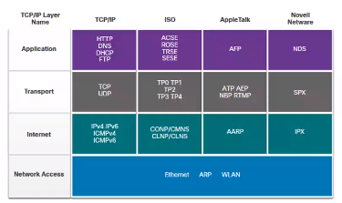
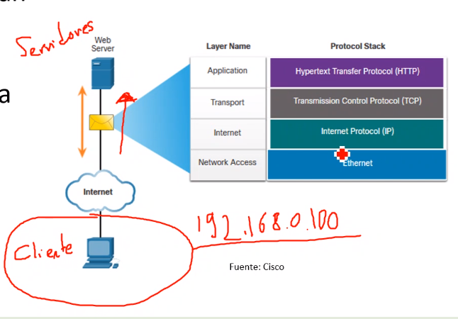
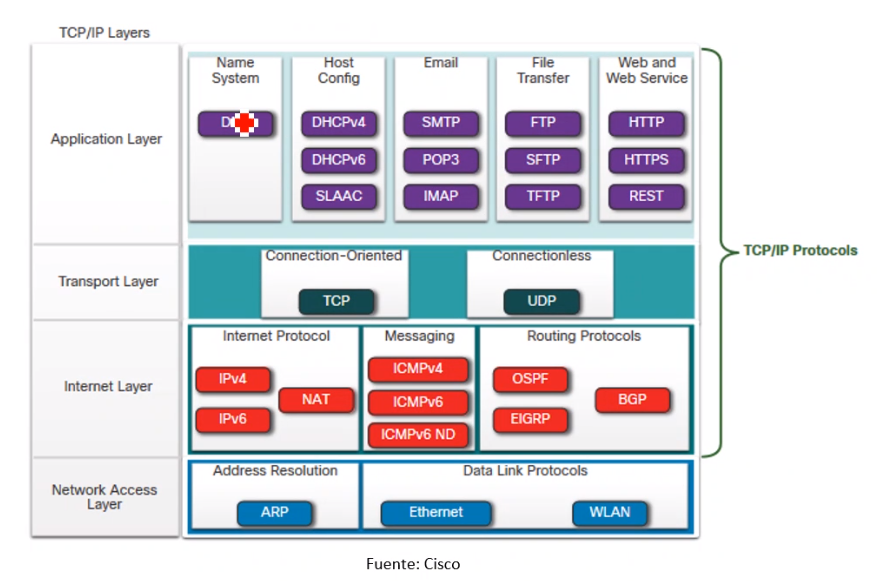
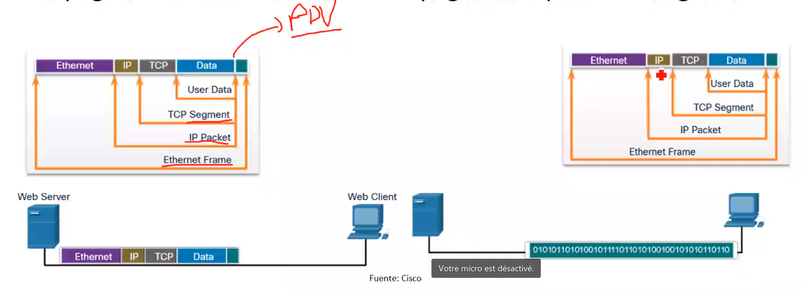
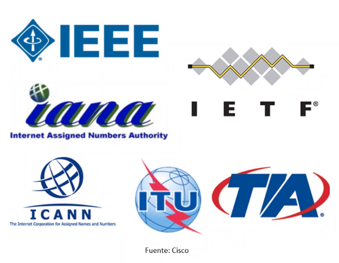
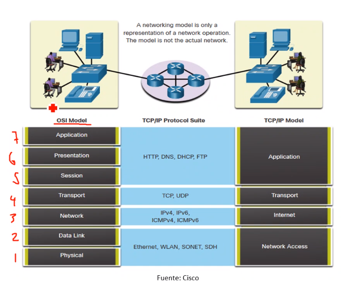
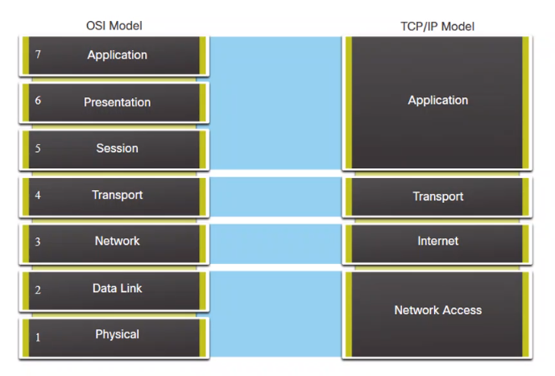
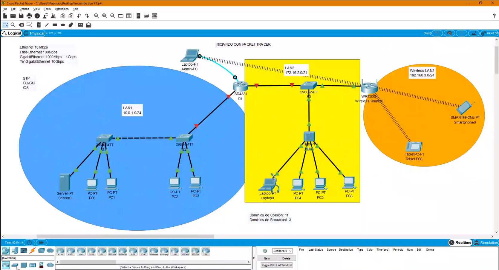

# 2020-11-20

## Contenido:

Fundamentos de networking

Direccionamiento IPv4, IPv6

Aseguramiento de red en capa 2 y capa 3

Ataques de red comunes

Software de aprendizaje de networking y emulación de redes

## Fundamentos de networking

### Que es una red

Es la interconexión de dos o más computadoras para compartir información y/o establecer comunicación entre sí

Tipos de dispositivos:

* Equipos finales o terminales de red (Host)

* Dispositivos activos de la red (Router, Firewall, bridge, etc)

### Tamaño de las redes de datos

PAN: Red de área personal
LAN: Red de área local
CAN: Red de area campus
MAN: Red de area metropolitana
WAN: Red de area amplia

### Conjuntos de protocolos

Hay muchos conjuntos de protocolos:

TCP/IP (El más utilizado) -> Operan en la capa de aplicación, transporte e internet. Los protocolos LAN de acceso a la red más comunes son Ethernet y WAN

Protocolos OSI

Apple Talk (propietario)

Novell Netware (propietario)

### Suite de protocolos TCP/IP

Protocolos abiertos, incluye muchos protocolos

#### Capa de aplicación

DNS: Nombres de dominio

DHCP, SLAAC: Host config

SMTP, POP3, IMAP: Email

FTP, SFTP, TFTP: Transferencia de archivos

HTTP, HTTPS, REST: Web

#### Capa de transporte

TCP: Orientado a conexión, se confirma la recepción de cada paquete, es más robusto que UDP

UDP: Connectionless, puede tener pérdidas, muy util en comunicación en tiempo real, es más ligero que TCP

#### Capa de internet

IPv4, IPv6, NAT: Internet protocol

IMCP: Mensajería

OSPF, EIGRP, BGP: Enrutamiento

#### Capa de acceso a la red

ARP: Resolución de direcciones

Ethernet, WLAN: Data link

### Proceso de comunicación TCP/IP

Un servidor encapsula y envía una página web a un cliente

Un cliente desecapsula la página web para el navegadorpro

### Estándares abiertos

Los estándares abiertos fomentan:

* Interoperabilidad

* Competencia

* Innovacion

#### Organizaciones

* Internet corporation for assigned names and numbers ICANN

* Internet assigned numbers authority (IANA)

### Estándares electrónicos y de comunicaciónes

IEEE

EIA

TIA

UIT-T

### Beneficios de utilizar modelo de capas

Los conceptos complejos de como funciona la red pueden ser difíciles de explicar y comprender, por este motivo se utiliza un modelo en capas

Dos modelos en capas describen las operaciones de red:

* Modelo de referencia de interconexión de sistema abierto (OSI)

* Modelo de referencia TCP/IP

### Beneficios de utilizar un modelo de capas

Ayudar en el diseño de protocolos porque los protocolos que operan en una capa específica han definido la información sobre la que actuan

### Modelo OSI

7 - Aplicación: Utilizados para las comunicaciones de proceso a proceso, permite la interacción usuario máquina en un lenguaje común

6 - Presentación: Proporciona una representación común de los datos requeridos entre los servicios de capa de aplicación de manera que permite dar el formato a los datos para que puedan ser abiertos con la aplicación correcta.

5 - Sesión: Se proporcionan servicios a la capa de presentación y para administrar el intercambio de datos

4 - Transporte: Define los servicios para segmentar, transferir y volver a ensamblar los datos para las comunicaciones individuales, permite que exista la comuicación de extremo a extremo, también garantiza que los datos sean entregados en el orden correcto sin cambios y sin modificaciones cuando es orientada a conexión. Cuando la comunicación no es orientada a comunicación permite que la comunicación se envíe del origen al destino de forma rápida.

3 - Red: Proporciona servicios para intercambiar datos individuales a través de la red

2 - Enlace de datos: Describe los métodos para intercambiar marcos de datos a través de un medio común, de esta capa para arriba todo es software, de aquí para abajo todo es hardware. En esta capa reside el direccionamiento físico BIA, se divide en 2 subcapas: MAC y LLC

1 - Física: Describe los medios para activar, mantener y desactivar las conexiones físicas, aquí está el hardware de red, medios, conectores y diferentes estándares, la PDU son los bits.

### Modelo TCP/IP

Aplicación

Transporte

Internet

Acceso a red

### OSI vs TCP/IP

## Dispositivos de red

### Funcionamiento del HUB o Concentrador

Son dispositivos de capa 1

Su mecanismo de transmisión es half duplex

Utiliza 2 hilos para transmitir y los mismos 2 para recibir

Se comporta como un cable, es decir, no modifica ni altera la información que pasa a través de él

Es un dispositivo "tonto" por no tener procesamiento de la información

Todo el HUB es un completo dominio de colisión

Recibe la información por uno de sus puertos y siempre trasmite por todos los demás

Divide el ancho de banda entre los dispositivos conectados

### Switch o conmutador

Tienen una tabla de MAC, cachea la MAC cuando un host envía información, asocia la MAC al puerto al que está conectados

Solo la primera vez que recibe una trama por un puerto la reenvía por todos los demás puertos. A partir de este momento, si necesitace reenviar información al mismo destino solamente la enviará al puerto que tenga la MAC correspondiente al destino

Cada host conectado a un switch conserva el 100 % del ancho de banda y garantiza un medio libre de colisiones

### Routers

Trabajan en la capa 3

## Software de aprendizaje de networking

Cisco packet tracer

Curso gratuito de packet tracer https://www.netacad.com/es/courses/packet-tracer/introduction-packet-tracer

NOTA: Dispositivos de capas diferentes se conectan con cable directo, si son de la misma capa se usa cable cruzado

Cantidad de dominios de broadcast = cantidad de redes LAN

Cantidad de dominios de colisión = Puertos del Switch

TTL -> Cantidad de saltos entre redes

### IOS

Sistema operativo de dispositivos de comunicación Cisco

#### CLI

##### Modo de usuario

Solo lectura

prompt >

`enable` para pasar al modo privilegiado

##### Modo privilegiado

Permite configurar el dispositivo

prompt #

`disable` para cambiar al modo usuario

`configure terminal` para cambiarse al modo config

`write` para escribir la configuración

##### Modo global config propt (config)#

modo sub config (cofig-if)#

`end` para salir al modo privilegiado

# 2020-11-23

## Software GNS3

GNS3 es un simulador gráfico de red lanzado en 2008, que te permite diseñar topologías de red complejas y poner en marcha simulaciones sobre ellos permitiendo la combinación de dispositivos tanto reales como virtuales.

### Instalación:

    pip3 install gns3-gui gns3-server pyqt5

se ejecuta con:

    gns3

